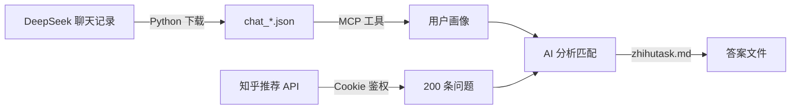
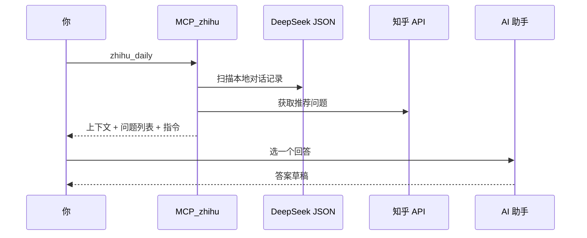
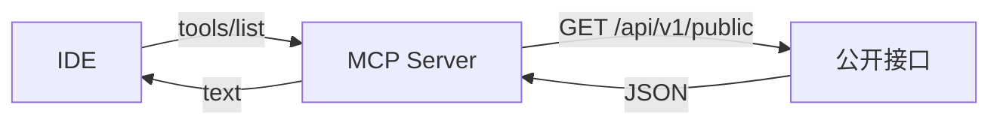
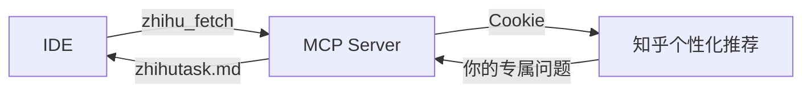
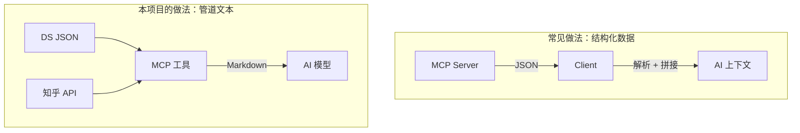
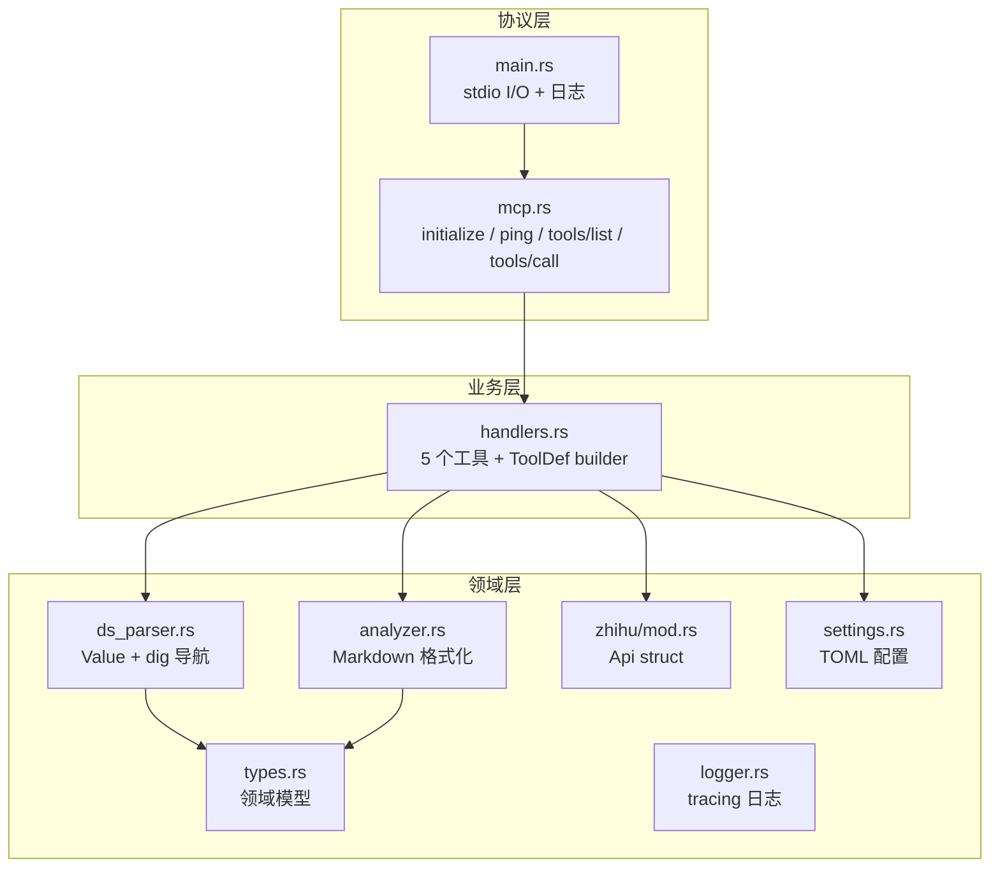
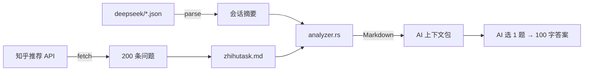

# AI Chat History DL + 知乎日常助手

DeepSeek 对话下载器（Python） + 知乎日常分析 MCP 服务（Rust）。



---

## 概览

本项目从你的 DeepSeek 对话记录中提取技术兴趣，匹配知乎推荐流中适合你回答的问题，并交由 AI 生成答案草稿。



---

## 关于 Cookie 的必要性——以及我们的歉意

坦率地说，这个工具对你有一个不太礼貌的要求：**它需要你提供知乎的浏览器 Cookie。**

我们对此深感抱歉。没有任何工具应当理所当然地索取用户的登录凭据，这种做法即便在本地运行的场景下也值得警惕。以下是我们必须这样做的技术原因——以及我们为避免滥用所采取的防护措施。

### 为什么不能只用 API Key？

大多数 MCP 工具的工作模式是这样的：



它们访问的是公开数据（天气、汇率、文档搜索），不涉及用户身份。这是优雅的、安全的、也是正确的方式。

然而，知乎的推荐流并非公开数据。它是一个**有状态、有身份**的接口——服务端根据请求头中的 Cookie 推断你是谁，然后返回**只对你一个人有意义的推荐列表**。这个推荐列表基于你的浏览历史、关注话题、点赞行为，别人拿不到，也复制不了。



换言之：如果你不提供 Cookie，这个工具**也能跑**——它只是拉不到推荐问题，等价于一个本地的 DS 对话分析器。但我们认为这样对用户价值不大，所以默认需要它。

### 你的 Cookie 去了哪里？

值得说明的是：Cookie 只做三件事，不做第四件。

| 用途 | 详情 |
|------|------|
| 写入本地 `settings.toml` | 与 exe 同级目录，纯文本，不压缩、不编码、不隐藏 |
| 附加到知乎 API 请求头 | 仅 `recommend` 和 `question` 两个接口 |
| 运行时驻留在进程内存 | 完全在用户机器上，不经过任何中转服务器 |

Cookie 不会被发送到本项目开发者控制的任何服务器。整个 MCP 服务只与两个外部端点通信：`api.zhihu.com`（你已经在浏览器中信任的域名）和本地文件系统。代码开源，可全文审计。

### 如果你仍然不放心

我们完全理解。你可以：

- 只配置 `deepseek_dir`，跳过知乎凭据——工具会优雅降级为纯本地分析
- 用一个不那么重要的知乎测试账号
- 审阅 `src/zhihu/mod.rs` 中所有 HTTP 请求代码（不足 80 行），确认没有异常出口

---

## 为什么输出 Markdown 而非结构化 JSON？

这是本项目的一个设计选择，我们认为值得说明。



现代大语言模型对 Markdown 的理解远好于原始 JSON。JSON 需要模型自己推断嵌套关系、忽略元数据字段、拼接上下文——每一步都可能引入理解偏差。而 Markdown 是模型训练语料中占比最高的结构化格式，其标题层级、列表、引用块构成了一套近乎无损的语义传递介质。

因此，本项目的所有工具输出均为纯 Markdown 文本：没有 `data.biz_data.chat_messages[0].fragments` 这样的嵌套路径，没有需要二次解析的协议残差。服务端负责完成异构数据源的提取与格式化，AI 只需阅读一段完整的叙事。

```
本地文件 → 提取 → 格式化 → 喂给 AI → 出答案
```

这并非什么独创——只是我们认为 MCP 工具对 AI 模型输出的形态，比它对人类输出的形态更重要。

---

## 一、Python: DeepSeek 对话下载器

### 功能

- 自动获取当前用户的所有会话列表（支持分页）
- 逐个下载每个会话的完整聊天历史
- 会话标题经过文件名字符安全处理
- 失败重试（409→自动等 1s，最多 5 次）
- 本地缓存会话列表，避免重复拉取
- 失败会话 ID 记录到 `error_session_ids.json`

### 依赖

```bash
pip install requests
```

### 获取凭据

登录 [chat.deepseek.com](https://chat.deepseek.com)，F12 → Network，找任意 API 请求：

| 凭据 | 来源 |
|------|------|
| Token | 请求头 `authorization`，去掉 `Bearer ` 前缀 |
| Cookie | 请求头 `cookie` 完整值 |

### 使用

```python
from aichat_histdl import Downloader

Downloader(token="<token>", cookie="<cookie>").run()
```

### 输出

| 文件 | 说明 |
|------|------|
| `deepseek/chat_{标题}.json` | 每个会话完整记录 |
| `session_ids.json` | 会话列表缓存 |
| `error_session_ids.json` | 下载失败的会话 |

---

## 二、Rust: 知乎日常助手 (`MCP_zhihu`)

### 简介

MCP (Model Context Protocol) 服务端，stdio JSON-RPC 2.0 与 IDE 通信。



### 构建

```bash
cargo build --release
# → target/release/MCP_zhihu.exe
```

### 工具列表

| 工具 | 参数 | 说明 |
|------|------|------|
| `zhihu_init` | `deepseek_dir?` `zhihu_cookie?` `zhihu_xsrf?` | 配置凭据，增量更新，写入 `settings.toml` |
| `zhihu_parse` | `dir?` `limit?` | 扫描 DS 目录，输出会话摘要（标题/提问数/示例），默认最近 50 个 |
| `zhihu_session` | `title` `dir?` | 按标题关键词模糊搜索，返回完整对话（每段截断 500 字） |
| `zhihu_fetch` | — | 拉取知乎推荐问题（~200 条），缓存至 `zhihutask.md` |
| `zhihu_daily` | `dir?` `limit?` | 完整流程：会话上下文 + 知乎问题 + AI 指令 |

### 无配置运行

`settings.toml` 不存在时自动创建默认配置（`deepseek_dir` = exe 同级 `deepseek/`，知乎凭据为空）。未配置凭据时优雅降级为提示信息。

### 数据流



### 输出产物

| 文件 | 说明 |
|------|------|
| `settings.toml` | 配置（`zhihu_init` 自动创建/更新） |
| `zhihutask.md` | 知乎问题缓存（`zhihu_fetch` 生成） |
| `logs/mcp.YYYY-MM-DD.log` | 结构化日志（daily rotation，保留 7 天） |

---

## 三、项目结构

```
aichathistorydl/
├── Cargo.toml
├── readme.md
├── changelog.md
├── session_ids.json
├── src/
│   ├── main.rs                      ← MCP stdio 主循环
│   ├── mcp.rs                       ← MCP 协议层
│   ├── handlers.rs                  ← 业务层（handler + ToolDef）
│   ├── ds_parser.rs                 ← DS JSON 解析（Value + dig）
│   ├── analyzer.rs                  ← 格式化输出
│   ├── types.rs                     ← 领域模型
│   ├── settings.rs                  ← TOML 配置管理
│   ├── logger.rs                    ← 结构化日志
│   ├── zhihu/mod.rs                 ← 知乎 API
│   ├── main.py                      ← Python 入口
│   └── aichat_histdl/               ← Python 下载器模块
│       ├── __init__.py
│       ├── downloader.py
│       ├── models.py
│       └── utils.py
└── target/release/                  ← 运行时目录
    ├── MPC_zhihu.exe
    ├── settings.toml
    ├── zhihutask.md
    ├── logs/
    └── deepseek/
```

---

## 四、Python API 参考

### `Downloader`

| 参数 | 类型 | 默认值 | 说明 |
|------|------|--------|------|
| `token` | `str` | `""` | Bearer Token |
| `cookie` | `str` | `""` | Cookie 字符串 |
| `output_dir` | `str` | `"deepseek"` | JSON 输出目录 |

| 方法 | 返回值 | 说明 |
|------|--------|------|
| `.run()` | `Downloader` | 一键：验证→拉会话→全部下载 |
| `.check()` | `bool` | 验证凭据 |
| `.sessions()` | `list[Session]` | 获取会话列表 |
| `.download(s)` | `dict\|None` | 下载单个会话 |

### `path_safe(text, max_len=240)`

文件名安全处理，非法字符→`_`。

---

## 免责声明

仅供个人学习与备份使用。请勿用于非法用途，确保符合 DeepSeek 及知乎服务条款。